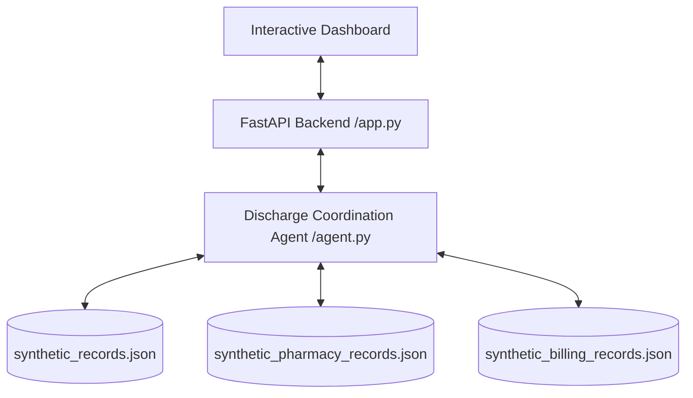

# ReadyGo™ | Autonomous Patient Discharge Validator

ReadyGo™ is an autonomous healthcare coordination agent designed to validate patient hospital discharge readiness. Built using Python, FastAPI, and the Model Context Protocol (MCP), it integrates clinical, pharmacy, and billing operations under strict zero-trust data governance.

The system utilizes three dedicated **FastMCP Servers** to execute tool-level Role-Based Access Control (RBAC) and enforce Protected Health Information (PHI) boundaries at the protocol level.

---

## 🏗️ Architecture Overview



### Protocol-Level Security & HIPAA Compliance
- **Clinical Data Isolation**: The Billing Server and pharmacy operations are strictly prohibited from accessing clinical notes.
- **PHI Leakage Detection**: The Billing Server automatically intercepts and rejects any payload containing diagnostic summaries or physician logs, enforcing zero-leak boundaries.
- **Role-Based Access**: Access to tools is context-restricted based on token roles (`clinical`, `pharmacy`, `billing`, `discharge`).

---

## 📦 Datasets Integrated

The system dynamically queries three core synthetic JSON databases:
1. **[EHR Database (synthetic_records.json)](file:///c:/Users/harsh/OneDrive/Documents/1.Antigravity-Projects/Project5-v1/synthetic_records.json)**: Contains patient records, diagnoses, and medication prescriptions.
2. **[Pharmacy Inventory (synthetic_pharmacy_records.json)](file:///c:/Users/harsh/OneDrive/Documents/1.Antigravity-Projects/Project5-v1/synthetic_pharmacy_records.json)**: Maps brand names to generics and tracks live stock counts and therapeutic alternatives.
3. **[Billing Catalog (synthetic_billing_records.json)](file:///c:/Users/harsh/OneDrive/Documents/1.Antigravity-Projects/Project5-v1/synthetic_billing_records.json)**: Maps medication items to standardized billing codes and hospital pricing.

---

## 🚀 Setup & Execution Guide

### 1. Activate the Virtual Environment
Before starting the servers, activate the pre-configured Python virtual environment:

**PowerShell:**
```powershell
.\projectenv\Scripts\Activate.ps1
```

**Command Prompt (cmd):**
```cmd
.\projectenv\Scripts\activate.bat
```

---

### 2. Run the Web Application
Launch the FastAPI server which coordinates the agent workflow and serves the premium front-end dashboard:

```powershell
# Change directory to the source files
cd Project5-v1

# Run the FastAPI server (it runs on http://127.0.0.1:8000)
python app.py
```

---

### 3. Open the Interactive Dashboard
Open your browser and navigate to:
- **Main App Portal**: [http://127.0.0.1:8000/](http://127.0.0.1:8000/) or [http://127.0.0.1:8000/demo-idea.html](http://127.0.0.1:8000/demo-idea.html)

#### Dashboard Features:
- **Patient Selector**: Dynamically populated dropdown with all patient cases from `synthetic_records.json`.
- **Reasoning Console**: A real-time terminal displaying trace messages between the agent and MCP servers.
- **MCP Server Badges**: Visual indicator showcasing which server (Clinical, Pharmacy, Billing) is currently active.
- **Readiness Outcome**: READY/NOT READY outcome summary with pricing, codes, and compliance checks.

---

## 🧪 Manual Execution & Debugging

To run the agent workflow directly via console and inspect stdout logs:

```powershell
python agent.py
```
